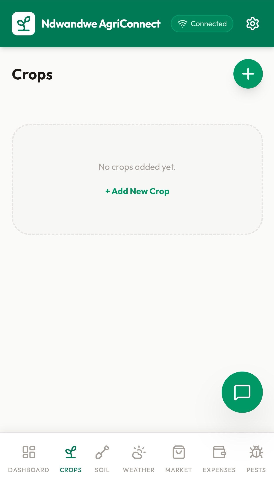
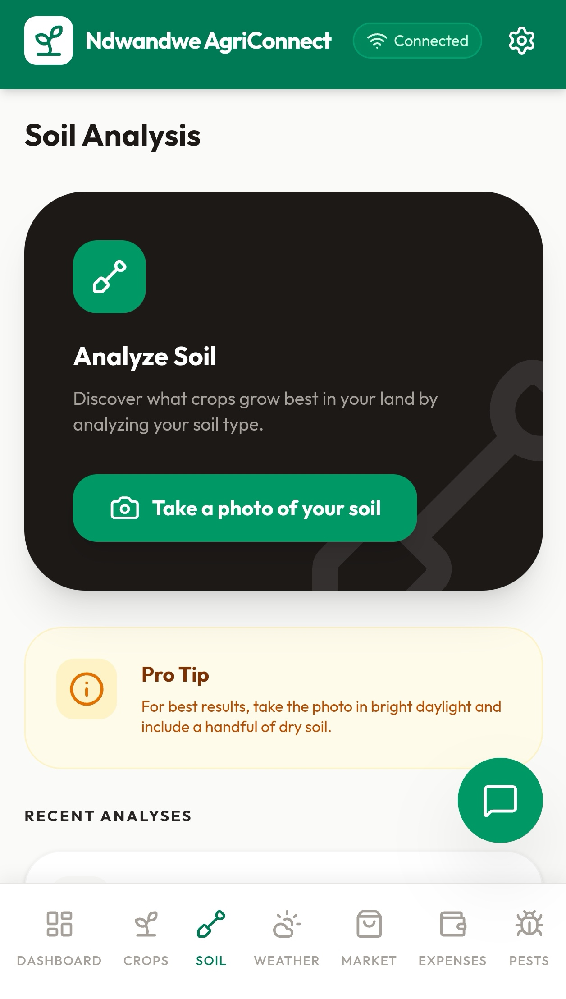
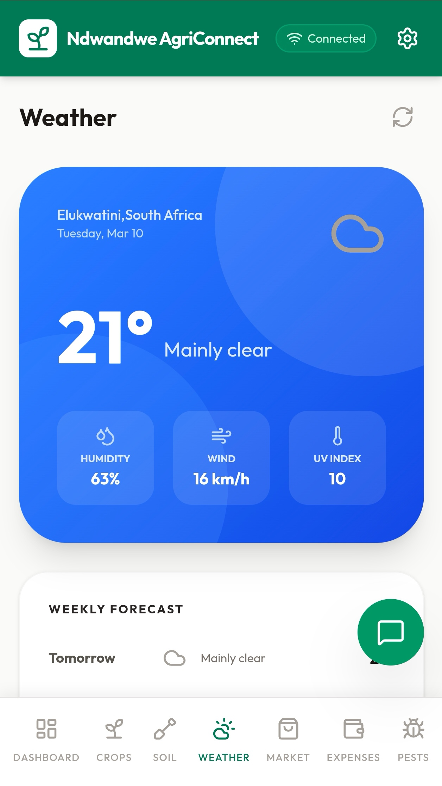
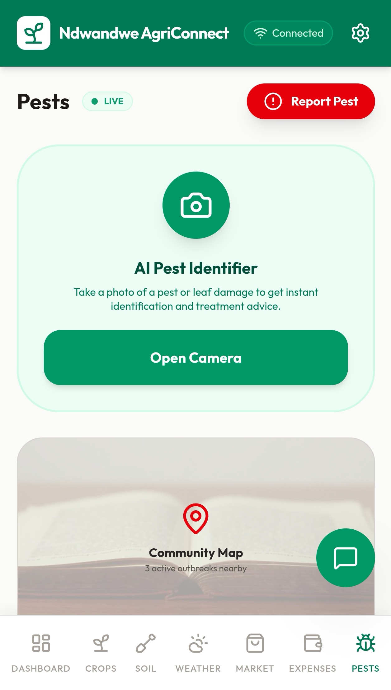
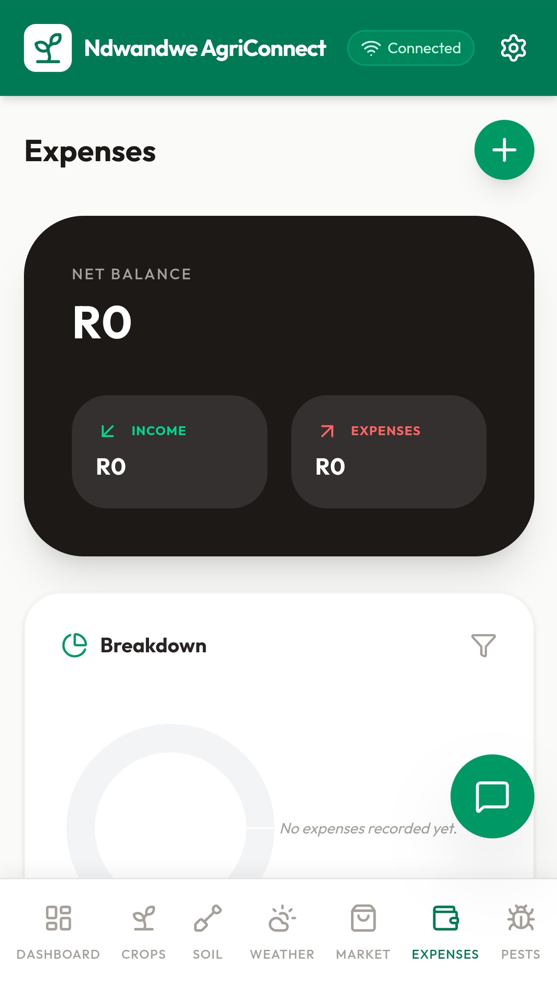
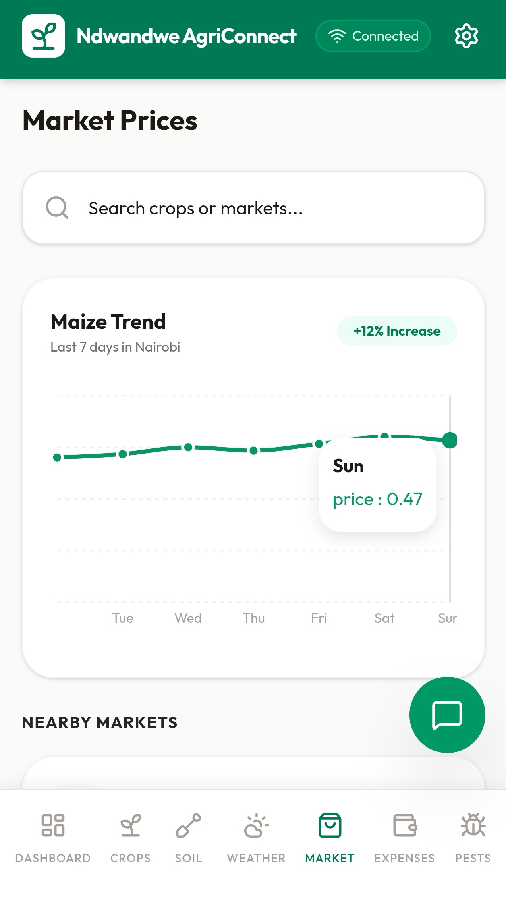

# Ndwandwe AgriConnect Africa 🌍🌱

Ndwandwe AgriConnect Africa is a digital farm management platform designed to help farmers across Africa manage crops, monitor weather, analyze soil health, track farm expenses, detect pests, and understand market trends using mobile technology.

The goal of this platform is to support farmers with digital tools that improve farm productivity, planning, and decision-making.

---

# Key Features

| Feature | Description |
|------|------|
| Farm Dashboard | Overview of farm operations |
| Crop Management | Track crops and fields |
| Soil Analysis | Analyze soil conditions |
| Weather Monitoring | Monitor weather forecasts |
| Pest Detection | Identify and manage pest risks |
| Farm Expenses | Track farming costs |
| Market Analysis | Monitor crop market prices |
| Farm Tasks | Manage daily farming activities |

---

# Application Screenshots

## Farm Dashboard

The dashboard provides farmers with a quick overview of farm operations including crop totals, weather conditions, financial information, and farm alerts.

---

## Crop Management

Farmers can easily add and manage crops, making it easier to organize fields and monitor production.

---

## Soil Analysis

The soil analysis feature helps farmers understand soil conditions and make better crop management decisions.

---

## Weather Monitoring

Farmers can monitor weather conditions and receive alerts that help them plan farming activities more effectively.

---

## Pest Detection

This feature helps farmers identify pest risks and protect crops from potential damage.

---

## Farm Expenses

Farmers can track farm expenses and monitor financial activities to better manage farm resources.

---

## Market Analysis

Farmers can monitor crop market prices and trends to make better decisions about when and where to sell their produce.

---

# Technology Concept

Ndwandwe AgriConnect Africa explores how digital technology can support farmers through:

• Mobile farm management systems  
• Agricultural data tracking  
• Weather monitoring tools  
• Pest detection systems  
• Farm financial tracking  
• Agricultural market insights  

---

# Project Roadmap

- [x] Farm dashboard prototype
- [x] Crop management interface
- [x] Soil analysis feature
- [x] Weather monitoring
- [x] Pest detection feature
- [x] Farm expense tracking
- [x] Market analysis concept
- [ ] Weather API integration
- [ ] Pest detection AI
- [ ] Market price live data
- [ ] Farm financial analytics

---

# Author

Linda Bonginkosi Mkhatshwa  

Computer Engineering Graduate  
Cisco Networking Academy Certified  

IT Support Technician | Network Technician

Location: Elukwatini, Mpumalanga, South Africa

---

# Contact

Email: ndwandwegroup@gmail.com

---

# Project Vision

Ndwandwe AgriConnect Africa aims to become a smart agricultural platform that helps farmers across Africa adopt digital technology to improve productivity, efficiency, and profitability.
